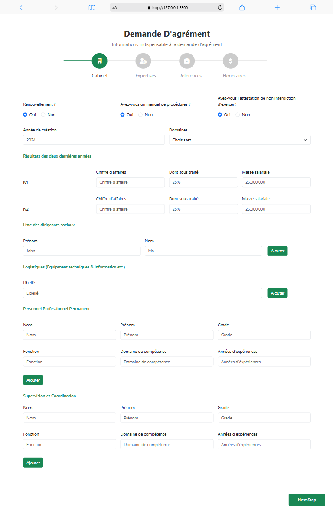
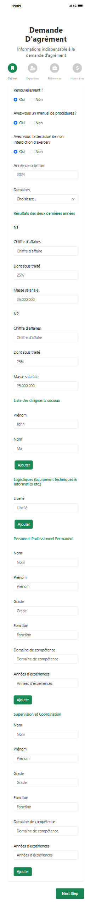
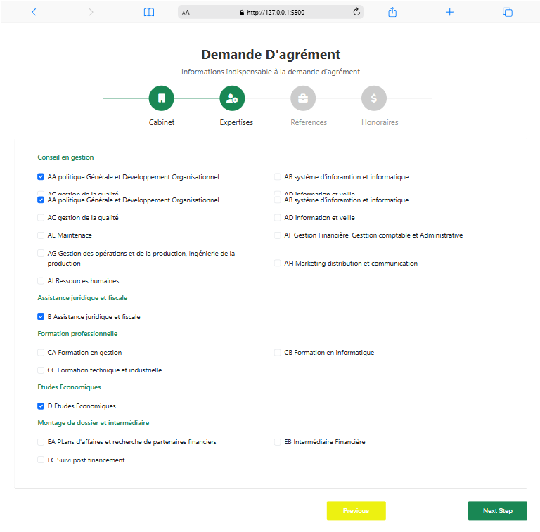
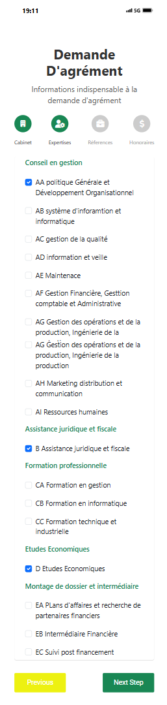
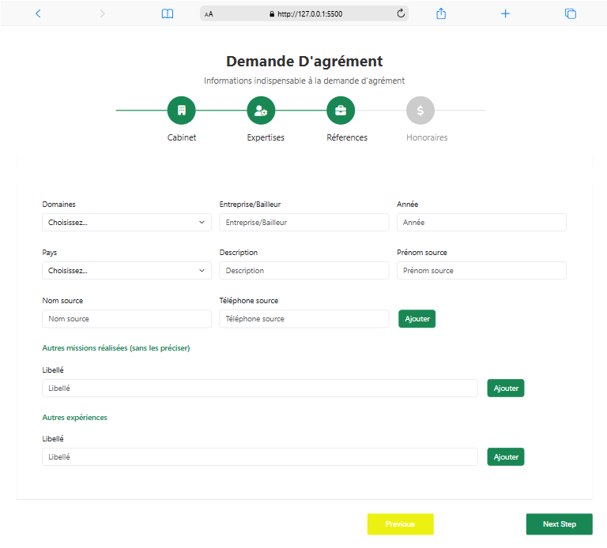
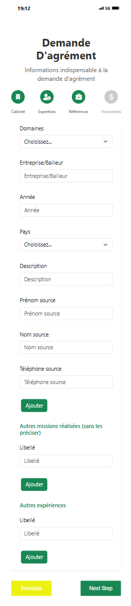
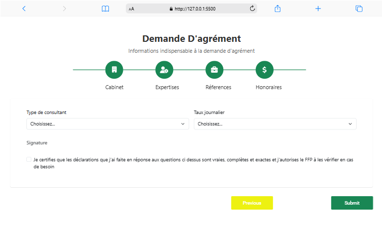
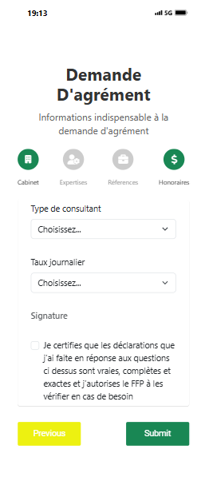

# Mini Projet de formulaire de demande d'Agréments

Ceci est mini projet concret de conception et de Développement d'un formulaire timeline permettant à enrégistrer les informations d'un client qui voudrait avoir une demande d'agrément dand une entreprise de la place.

## Table de contenu

- [Vue d'ensembel](#vue-d-ensemble)
  - [Travail à faire](#TAF)
  - [Screenshot](#screenshot)

- [Comment j'ai procédé](#Procedure)
  - [Conçu et développer avec](#Ouils)
  - [Mes difficultés](#difficulty)
  - [Pret pour un nouveau défi](#continuite)
  - [Ressources utilisées](#Ressources)
- [Backend](#Backend)
  - [Technologies utilisées](#Technologies)
  - [Installation et exécution](#Installation)
  - [API Endpoints](#API)
- [Auteur](#Auteur)
- [Je tiens à remercier](#Remerciements)

## Vue-d-ensemble
J'ai commencé ce projet le lundi 26 Mai 
024 et je l'ai achevé le Vendredi 31 Mai 2024

### TAF
J'étais chargé de :

- Concevoir la maquette design sur le logiciel Figma 
- Développer la maquette du formulaire grace à des langages de programmation.

### Screenshot











## Procedure

1- Conception de la maquette en m'inspirant de modèles
2- Importation d'un modèle correspondant à ma maquette et réalisable par les technologies souhaitée
3- Développement de la page et des sections avec Bootstrap (prise en charge de la responsivité) suivant le maquette réalisée en amont
4- Intégration des librairies Jquerry pour le dynamisme et l'interaction
5- personnalisation en fonction de mes besoins (couleurs, tailles, positionnement)

### Outils :

- HtmL5
- CSS
- Bootstrap
- JavaScript / Jquerry

### Difficulty

Aucune() 


### Continuite 

Durant cette conception j'ai pas mal aimé le faite de chercher et trouver enfin ce dont je cherchais et je suis pret à relever d'autres défis allant dans mon apprentissage et mon expérience.


### Ressources

- [Colorlib](https://colorlib.com/) - Ce site m'a permis de m'inspirer sur mon Design du formulaire afin de réaliser ma maquette sur figma et dans mon Développement
- [cdnjs](https://cdnjs.com/libraries/font-awesome) - Cette ressource met à la disposition de tout développeur des liens CDN pour la prise en charge de l'iconographie dans une page web.
- [fontawesome](https://fontawesome.com/) - Resources pour le téléchargement et/ou l'insertion à base de lien des icones en collaboration avec cdnjs.
- [bootstrap] (https://getbootstrap.com/docs/5.3/getting-started/introduction/) - Sans doute la ressoure utilisée à +60% de tout le projet
- [Javacript/Jquery]


## Backend

Le backend a été implémenté avec Python et SQLite3 pour stocker les données du formulaire.

### Technologies

- Python 3.x
- Flask (framework web)
- SQLite3 (base de données)

### Installation

1. Cloner le dépôt :
```bash
git clone <url-du-repo>
cd Formulaire-timeline-Demande-d-agr-ment
```

2. Créer un environnement virtuel et l'activer :
```bash
python -m venv venv
source venv/bin/activate  # Sur Windows: venv\Scripts\activate
```

3. Installer les dépendances :
```bash
pip install -r backend/requirements.txt
```

4. Exécuter le script de configuration pour initialiser la base de données et copier les fichiers statiques :
```bash
cd backend
python setup.py
```

5. Lancer l'application :
```bash
python app.py
```

L'application sera accessible à l'adresse http://localhost:5000

6. Tester l'API (optionnel) :
```bash
# Assurez-vous que l'application est en cours d'exécution dans un autre terminal
python test_api.py
```

### API

Le backend fournit plusieurs endpoints API pour gérer les données du formulaire :

- `/api/submit` : Soumettre le formulaire complet
- `/api/cabinet/<id>` : Récupérer les données d'un cabinet
- Endpoints spécifiques pour chaque section du formulaire

Pour plus de détails, consultez le [README du backend](backend/README.md).


## Auteur

- LinkedIn - [@joel-gaetan-hassam-obah](https://www.linkedin.com/in/joel-gaetan-hassam-obah/)
- X (Anciennement Twitter) - [@obah_joel5785](https://x.com/obah_joel5785)


## Remerciements
Je tenais à remercier mon frère Joel Freddy Mengara Zeh [https://www.linkedin.com/in/joel-freddy-mengara/] pour m'avoir donné la grace de me mettre à rude épreuve avec ce projet concret où je l'ai assisté et Youssouf Traoré [https://www.linkedin.com/in/youssouf-traore/], mon camarade à ISM et Etudiant comme moi de m'avoir encouragé et donner de la motivation afin que je ne lache pas les bras. Ainsi que l'auteur du template boostrap Rock Krivec [https://colorlib.com/wp/author/rokrivec/] de colorlibs.
